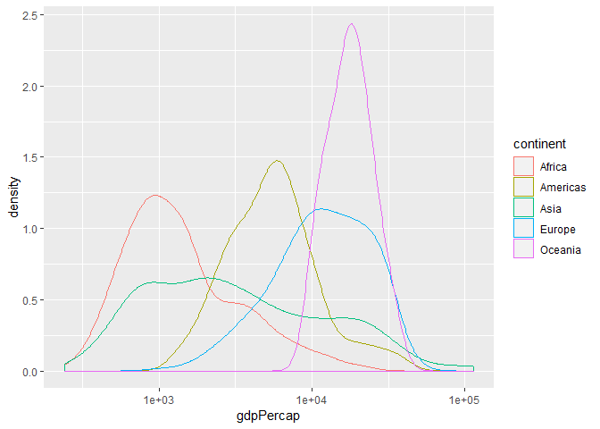
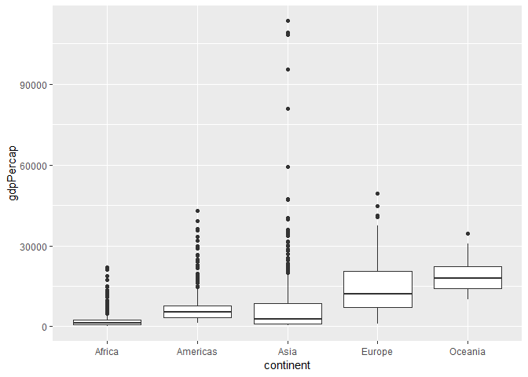
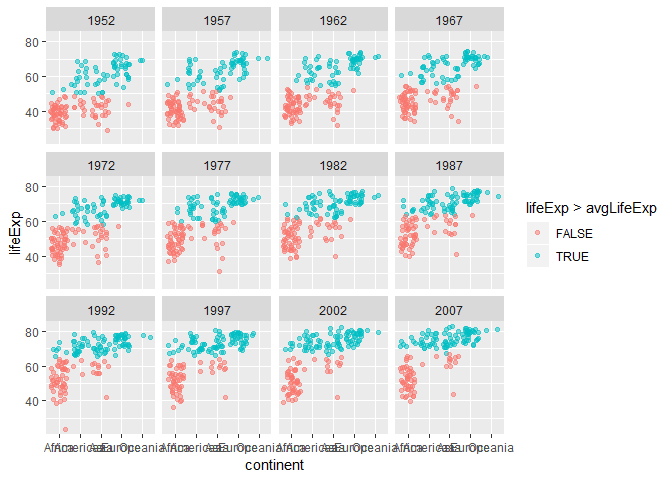
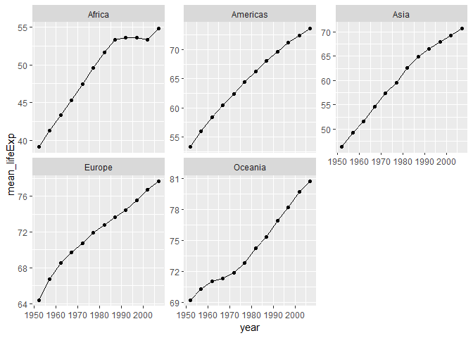
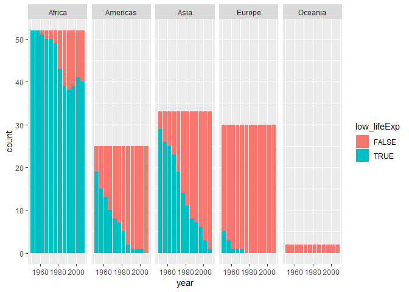
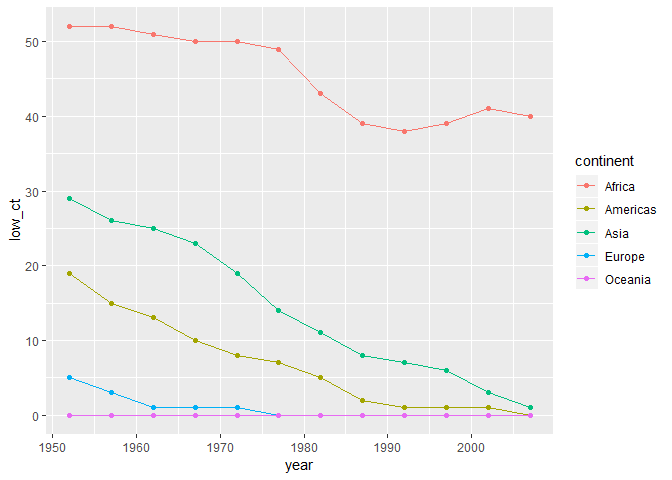
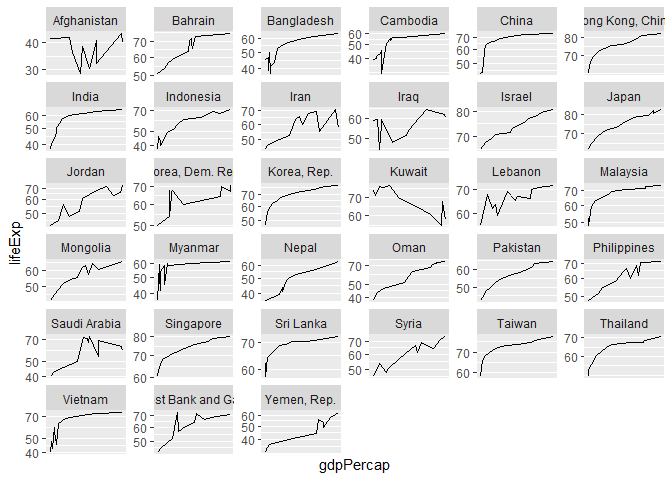
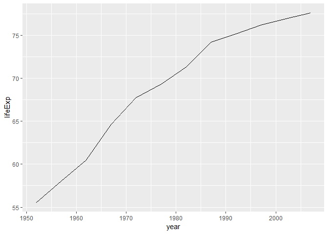
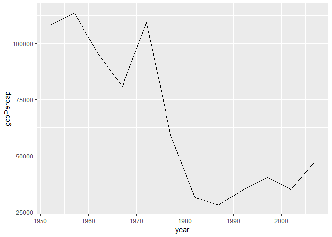

STAT 545A Homework 3
================
Tian Gao
2018/9/27

# Bring rectangular data in

``` r
library(gapminder)
library(tidyverse)
```

    ## -- Attaching packages ------------------------------------- tidyverse 1.2.1 --

    ## √ ggplot2 3.0.0     √ purrr   0.2.5
    ## √ tibble  1.4.2     √ dplyr   0.7.6
    ## √ tidyr   0.8.1     √ stringr 1.3.1
    ## √ readr   1.1.1     √ forcats 0.3.0

    ## -- Conflicts ---------------------------------------- tidyverse_conflicts() --
    ## x dplyr::filter() masks stats::filter()
    ## x dplyr::lag()    masks stats::lag()

# Get the maximum and minimum of GDP per capita for all continents.

``` r
# get data of maximum and minimum of GDP per capita for all continents
gapminder %>% 
  # group by continent
  group_by(continent) %>% 
  # calculate summaries
  summarize(
    max_gdpPercap = max(gdpPercap),
    min_gdpPercap = min(gdpPercap),
  )%>%
  knitr::kable()
```

| continent | max\_gdpPercap | min\_gdpPercap |
| :-------- | -------------: | -------------: |
| Africa    |       21951.21 |       241.1659 |
| Americas  |       42951.65 |      1201.6372 |
| Asia      |      113523.13 |       331.0000 |
| Europe    |       49357.19 |       973.5332 |
| Oceania   |       34435.37 |     10039.5956 |

# Look at the spread of GDP per capita within the continents.

  - First I’ll show the table of min, max, mean, sd of GDP percap

<!-- end list -->

``` r
gapminder %>%
  group_by(continent) %>%
  summarize(
    min_GDPPercap = min(gdpPercap),
    max_GDPPercap = max(gdpPercap),
    mean_GDPPercap = mean(gdpPercap),
    sd_GDPPercap = sd(gdpPercap)
  )%>%
  knitr::kable()
```

| continent | min\_GDPPercap | max\_GDPPercap | mean\_GDPPercap | sd\_GDPPercap |
| :-------- | -------------: | -------------: | --------------: | ------------: |
| Africa    |       241.1659 |       21951.21 |        2193.755 |      2827.930 |
| Americas  |      1201.6372 |       42951.65 |        7136.110 |      6396.764 |
| Asia      |       331.0000 |      113523.13 |        7902.150 |     14045.373 |
| Europe    |       973.5332 |       49357.19 |       14469.476 |      9355.213 |
| Oceania   |     10039.5956 |       34435.37 |       18621.609 |      6358.983 |

  - In order to show the spread of GDP per capita within the continents,
    a plot should be clear and easy to understand. I put the
    distribution of all continents in one plot, thus the difference is
    obvious.

<!-- end list -->

``` r
gapminder %>% 
  # gdpPercap as x axis
  ggplot(aes(x=gdpPercap, color=continent)) +
  # scale the x axis as the variance between continents is huge
  scale_x_log10()+
  # show the distribution of data
  geom_density()
```

<!-- -->

  - Then I’ll show the numbers in above table using box plot

<!-- end list -->

``` r
gapminder %>%
  ggplot(aes(x=continent, y=gdpPercap)) + 
  geom_boxplot()
```

<!-- -->

# Compute a trimmed mean of life expectancy for different years. Or a weighted mean, weighting by population. Just try something other than the plain vanilla mean.

  - For this part I will calculate the weighted mean, weighting by
    population

<!-- end list -->

``` r
gapminder %>%
  group_by(year) %>%
  summarize(
    vanilla_mean_lifeExp = mean(lifeExp),
    weighted_mean_lifeExp = weighted.mean(lifeExp,pop)
  )%>%
  knitr::kable()
```

| year | vanilla\_mean\_lifeExp | weighted\_mean\_lifeExp |
| ---: | ---------------------: | ----------------------: |
| 1952 |               49.05762 |                48.94424 |
| 1957 |               51.50740 |                52.12189 |
| 1962 |               53.60925 |                52.32438 |
| 1967 |               55.67829 |                56.98431 |
| 1972 |               57.64739 |                59.51478 |
| 1977 |               59.57016 |                61.23726 |
| 1982 |               61.53320 |                62.88176 |
| 1987 |               63.21261 |                64.41635 |
| 1992 |               64.16034 |                65.64590 |
| 1997 |               65.01468 |                66.84934 |
| 2002 |               65.69492 |                67.83904 |
| 2007 |               67.00742 |                68.91909 |

  - It is not obvious enough shown in the above table. Thus I try to put
    this into a plot.

<!-- end list -->

``` r
gapminder %>%
  group_by(year) %>%
  mutate(avgLifeExp = weighted.mean(lifeExp)) %>%
  ggplot(aes(x = continent, y = lifeExp)) + 
  geom_jitter(alpha = 0.5, aes(color = lifeExp>avgLifeExp))+ 
  facet_wrap( ~year)
```

<!-- -->

# How is life expectancy changing over time on different continents?

  - First I’ll document the life expectancy in a table for each
    continent
  - Asia

<!-- end list -->

``` r
gapminder %>%
  filter(continent == 'Asia') %>%
  group_by(year) %>%
  summarize(Avg=mean(lifeExp))%>%
  knitr::kable()
```

| year |      Avg |
| ---: | -------: |
| 1952 | 46.31439 |
| 1957 | 49.31854 |
| 1962 | 51.56322 |
| 1967 | 54.66364 |
| 1972 | 57.31927 |
| 1977 | 59.61056 |
| 1982 | 62.61794 |
| 1987 | 64.85118 |
| 1992 | 66.53721 |
| 1997 | 68.02052 |
| 2002 | 69.23388 |
| 2007 | 70.72848 |

  - Africa

<!-- end list -->

``` r
gapminder %>%
  filter(continent == 'Africa') %>%
  group_by(year) %>%
  summarize(Avg=mean(lifeExp))%>%
  knitr::kable()
```

| year |      Avg |
| ---: | -------: |
| 1952 | 39.13550 |
| 1957 | 41.26635 |
| 1962 | 43.31944 |
| 1967 | 45.33454 |
| 1972 | 47.45094 |
| 1977 | 49.58042 |
| 1982 | 51.59287 |
| 1987 | 53.34479 |
| 1992 | 53.62958 |
| 1997 | 53.59827 |
| 2002 | 53.32523 |
| 2007 | 54.80604 |

  - Americas

<!-- end list -->

``` r
gapminder %>%
  filter(continent == 'Americas') %>%
  group_by(year) %>%
  summarize(Avg=mean(lifeExp))%>%
  knitr::kable()
```

| year |      Avg |
| ---: | -------: |
| 1952 | 53.27984 |
| 1957 | 55.96028 |
| 1962 | 58.39876 |
| 1967 | 60.41092 |
| 1972 | 62.39492 |
| 1977 | 64.39156 |
| 1982 | 66.22884 |
| 1987 | 68.09072 |
| 1992 | 69.56836 |
| 1997 | 71.15048 |
| 2002 | 72.42204 |
| 2007 | 73.60812 |

  - Europe

<!-- end list -->

``` r
gapminder %>%
  filter(continent == 'Europe') %>%
  group_by(year) %>%
  summarize(Avg=mean(lifeExp))%>%
  knitr::kable()
```

| year |      Avg |
| ---: | -------: |
| 1952 | 64.40850 |
| 1957 | 66.70307 |
| 1962 | 68.53923 |
| 1967 | 69.73760 |
| 1972 | 70.77503 |
| 1977 | 71.93777 |
| 1982 | 72.80640 |
| 1987 | 73.64217 |
| 1992 | 74.44010 |
| 1997 | 75.50517 |
| 2002 | 76.70060 |
| 2007 | 77.64860 |

  - Oceania

<!-- end list -->

``` r
gapminder %>%
  filter(continent == 'Oceania') %>%
  group_by(year) %>%
  summarize(Avg=mean(lifeExp))%>%
  knitr::kable()
```

| year |     Avg |
| ---: | ------: |
| 1952 | 69.2550 |
| 1957 | 70.2950 |
| 1962 | 71.0850 |
| 1967 | 71.3100 |
| 1972 | 71.9100 |
| 1977 | 72.8550 |
| 1982 | 74.2900 |
| 1987 | 75.3200 |
| 1992 | 76.9450 |
| 1997 | 78.1900 |
| 2002 | 79.7400 |
| 2007 | 80.7195 |

  - As table is not obvious enough to show the data, I’ll then draw a
    plot to reflect this.

<!-- end list -->

``` r
gapminder %>%
  group_by(continent, year) %>%
  summarize(
    mean_lifeExp = mean(lifeExp)
  )%>%
  # year as x axis and mean_lifeExp as y axis
  ggplot(aes(year, mean_lifeExp)) +
  
  # facetting by continent
  facet_wrap(~continent, scales = "free_y")+
  # make a line plot with points
  geom_line() +
  geom_point()
```

<!-- -->

  - From the plot above we can see that the life expectancy is
    increasing over the
years.

# Report the absolute and/or relative abundance of countries with low life expectancy over time by continent: Compute some measure of worldwide life expectancy – you decide – a mean or median or some other quantile or perhaps your current age. Then determine how many countries on each continent have a life expectancy less than this benchmark, for each year.

  - For this question I chose mean as the benchmark

<!-- end list -->

``` r
mean(gapminder$lifeExp)
```

    ## [1] 59.47444

  - Before I make a plot, I’ll first show in table how to determine
    whether a country have a life expectancy lower that benchmark.

<!-- end list -->

``` r
 gapminder %>% 
  group_by(country, year) %>% 
  # check if a country has low lifeExp
  mutate(
    low_lifeExp = lifeExp < mean(gapminder$lifeExp)
  ) %>% 
  select(country, year, lifeExp, low_lifeExp)%>%
  head(100)%>%
  knitr::kable()
```

| country     | year | lifeExp | low\_lifeExp |
| :---------- | ---: | ------: | :----------- |
| Afghanistan | 1952 |  28.801 | TRUE         |
| Afghanistan | 1957 |  30.332 | TRUE         |
| Afghanistan | 1962 |  31.997 | TRUE         |
| Afghanistan | 1967 |  34.020 | TRUE         |
| Afghanistan | 1972 |  36.088 | TRUE         |
| Afghanistan | 1977 |  38.438 | TRUE         |
| Afghanistan | 1982 |  39.854 | TRUE         |
| Afghanistan | 1987 |  40.822 | TRUE         |
| Afghanistan | 1992 |  41.674 | TRUE         |
| Afghanistan | 1997 |  41.763 | TRUE         |
| Afghanistan | 2002 |  42.129 | TRUE         |
| Afghanistan | 2007 |  43.828 | TRUE         |
| Albania     | 1952 |  55.230 | TRUE         |
| Albania     | 1957 |  59.280 | TRUE         |
| Albania     | 1962 |  64.820 | FALSE        |
| Albania     | 1967 |  66.220 | FALSE        |
| Albania     | 1972 |  67.690 | FALSE        |
| Albania     | 1977 |  68.930 | FALSE        |
| Albania     | 1982 |  70.420 | FALSE        |
| Albania     | 1987 |  72.000 | FALSE        |
| Albania     | 1992 |  71.581 | FALSE        |
| Albania     | 1997 |  72.950 | FALSE        |
| Albania     | 2002 |  75.651 | FALSE        |
| Albania     | 2007 |  76.423 | FALSE        |
| Algeria     | 1952 |  43.077 | TRUE         |
| Algeria     | 1957 |  45.685 | TRUE         |
| Algeria     | 1962 |  48.303 | TRUE         |
| Algeria     | 1967 |  51.407 | TRUE         |
| Algeria     | 1972 |  54.518 | TRUE         |
| Algeria     | 1977 |  58.014 | TRUE         |
| Algeria     | 1982 |  61.368 | FALSE        |
| Algeria     | 1987 |  65.799 | FALSE        |
| Algeria     | 1992 |  67.744 | FALSE        |
| Algeria     | 1997 |  69.152 | FALSE        |
| Algeria     | 2002 |  70.994 | FALSE        |
| Algeria     | 2007 |  72.301 | FALSE        |
| Angola      | 1952 |  30.015 | TRUE         |
| Angola      | 1957 |  31.999 | TRUE         |
| Angola      | 1962 |  34.000 | TRUE         |
| Angola      | 1967 |  35.985 | TRUE         |
| Angola      | 1972 |  37.928 | TRUE         |
| Angola      | 1977 |  39.483 | TRUE         |
| Angola      | 1982 |  39.942 | TRUE         |
| Angola      | 1987 |  39.906 | TRUE         |
| Angola      | 1992 |  40.647 | TRUE         |
| Angola      | 1997 |  40.963 | TRUE         |
| Angola      | 2002 |  41.003 | TRUE         |
| Angola      | 2007 |  42.731 | TRUE         |
| Argentina   | 1952 |  62.485 | FALSE        |
| Argentina   | 1957 |  64.399 | FALSE        |
| Argentina   | 1962 |  65.142 | FALSE        |
| Argentina   | 1967 |  65.634 | FALSE        |
| Argentina   | 1972 |  67.065 | FALSE        |
| Argentina   | 1977 |  68.481 | FALSE        |
| Argentina   | 1982 |  69.942 | FALSE        |
| Argentina   | 1987 |  70.774 | FALSE        |
| Argentina   | 1992 |  71.868 | FALSE        |
| Argentina   | 1997 |  73.275 | FALSE        |
| Argentina   | 2002 |  74.340 | FALSE        |
| Argentina   | 2007 |  75.320 | FALSE        |
| Australia   | 1952 |  69.120 | FALSE        |
| Australia   | 1957 |  70.330 | FALSE        |
| Australia   | 1962 |  70.930 | FALSE        |
| Australia   | 1967 |  71.100 | FALSE        |
| Australia   | 1972 |  71.930 | FALSE        |
| Australia   | 1977 |  73.490 | FALSE        |
| Australia   | 1982 |  74.740 | FALSE        |
| Australia   | 1987 |  76.320 | FALSE        |
| Australia   | 1992 |  77.560 | FALSE        |
| Australia   | 1997 |  78.830 | FALSE        |
| Australia   | 2002 |  80.370 | FALSE        |
| Australia   | 2007 |  81.235 | FALSE        |
| Austria     | 1952 |  66.800 | FALSE        |
| Austria     | 1957 |  67.480 | FALSE        |
| Austria     | 1962 |  69.540 | FALSE        |
| Austria     | 1967 |  70.140 | FALSE        |
| Austria     | 1972 |  70.630 | FALSE        |
| Austria     | 1977 |  72.170 | FALSE        |
| Austria     | 1982 |  73.180 | FALSE        |
| Austria     | 1987 |  74.940 | FALSE        |
| Austria     | 1992 |  76.040 | FALSE        |
| Austria     | 1997 |  77.510 | FALSE        |
| Austria     | 2002 |  78.980 | FALSE        |
| Austria     | 2007 |  79.829 | FALSE        |
| Bahrain     | 1952 |  50.939 | TRUE         |
| Bahrain     | 1957 |  53.832 | TRUE         |
| Bahrain     | 1962 |  56.923 | TRUE         |
| Bahrain     | 1967 |  59.923 | FALSE        |
| Bahrain     | 1972 |  63.300 | FALSE        |
| Bahrain     | 1977 |  65.593 | FALSE        |
| Bahrain     | 1982 |  69.052 | FALSE        |
| Bahrain     | 1987 |  70.750 | FALSE        |
| Bahrain     | 1992 |  72.601 | FALSE        |
| Bahrain     | 1997 |  73.925 | FALSE        |
| Bahrain     | 2002 |  74.795 | FALSE        |
| Bahrain     | 2007 |  75.635 | FALSE        |
| Bangladesh  | 1952 |  37.484 | TRUE         |
| Bangladesh  | 1957 |  39.348 | TRUE         |
| Bangladesh  | 1962 |  41.216 | TRUE         |
| Bangladesh  | 1967 |  43.453 | TRUE         |

  - From here, we can plot based on the number of boolean value. More
    specificly we can count the number of appearance of TRUE.

<!-- end list -->

``` r
 gapminder %>% 
  group_by(country, year) %>% 
  # check if a country has low lifeExp
  mutate(
    low_lifeExp = lifeExp < mean(gapminder$lifeExp)
  ) %>% 
  ggplot(aes(x=year, fill=low_lifeExp)) +
  facet_grid(~continent)+
  # make it a bar plot
  geom_bar()
```

<!-- -->

``` r
 gapminder %>% 
  group_by(continent, year) %>% 
  mutate(
    low_lifeExp = lifeExp < mean(gapminder$lifeExp)
  ) %>%
  summarise(low_ct = sum(low_lifeExp))%>%
  ggplot(aes(x=year, y=low_ct)) +
  # make it a bar plot
  geom_line(aes(color = continent))+
   geom_point(aes(color = continent))
```

<!-- -->

  - The plot above is the report of absolute of countries with low life
    expectancy over time by
continent

# Find countries with interesting stories. Open-ended and, therefore, hard. Promising but unsuccessful attempts are encouraged. This will generate interesting questions to follow up on in class.

  - For this part I will try to find the relation between gdpPercap and
    lifeExp .

<!-- end list -->

``` r
gapminder%>%
  filter(continent == "Asia") %>%
  # pop as x axis and lifeExp as y axis
  ggplot(aes(x=gdpPercap, y=lifeExp)) +
  # scale y axis by log10
  scale_y_log10() +
  # facetting by country
  facet_wrap(~country, scales="free") +
  # make a line plot
  geom_line() +
  # make a better x axis
  scale_x_continuous(breaks=NULL)
```

<!-- -->

  - From the plot above we can see that for most of the countries,
    lifeExp increases as the gdpPercap increase. However, some countries
    has a period when the lifeExp decrease as the gdpPercap increase.

  - I’ll then try to find the reason. From the graphs above, we can see
    that Kuwait is the most typical one. So I will take Kuwait for
    example.

<!-- end list -->

``` r
kuwait <- gapminder %>%
  filter(country == "Kuwait")

kuwait
```

    ## # A tibble: 12 x 6
    ##    country continent  year lifeExp     pop gdpPercap
    ##    <fct>   <fct>     <int>   <dbl>   <int>     <dbl>
    ##  1 Kuwait  Asia       1952    55.6  160000   108382.
    ##  2 Kuwait  Asia       1957    58.0  212846   113523.
    ##  3 Kuwait  Asia       1962    60.5  358266    95458.
    ##  4 Kuwait  Asia       1967    64.6  575003    80895.
    ##  5 Kuwait  Asia       1972    67.7  841934   109348.
    ##  6 Kuwait  Asia       1977    69.3 1140357    59265.
    ##  7 Kuwait  Asia       1982    71.3 1497494    31354.
    ##  8 Kuwait  Asia       1987    74.2 1891487    28118.
    ##  9 Kuwait  Asia       1992    75.2 1418095    34933.
    ## 10 Kuwait  Asia       1997    76.2 1765345    40301.
    ## 11 Kuwait  Asia       2002    76.9 2111561    35110.
    ## 12 Kuwait  Asia       2007    77.6 2505559    47307.

``` r
kuwait %>%
  ggplot(aes(year, pop))+
  geom_line()
```

<!-- -->

``` r
kuwait %>%
  ggplot(aes(year, lifeExp))+
  geom_line()
```

<!-- -->

``` r
kuwait %>%
  ggplot(aes(year, gdpPercap))+
  geom_line()
```

<!-- -->

  - One interesting thing about Kuwait is that there is a period when
    the gdpPercap is decreasing and both the population and lifeExp are
    increasing. This phenomenon is abnormal.
